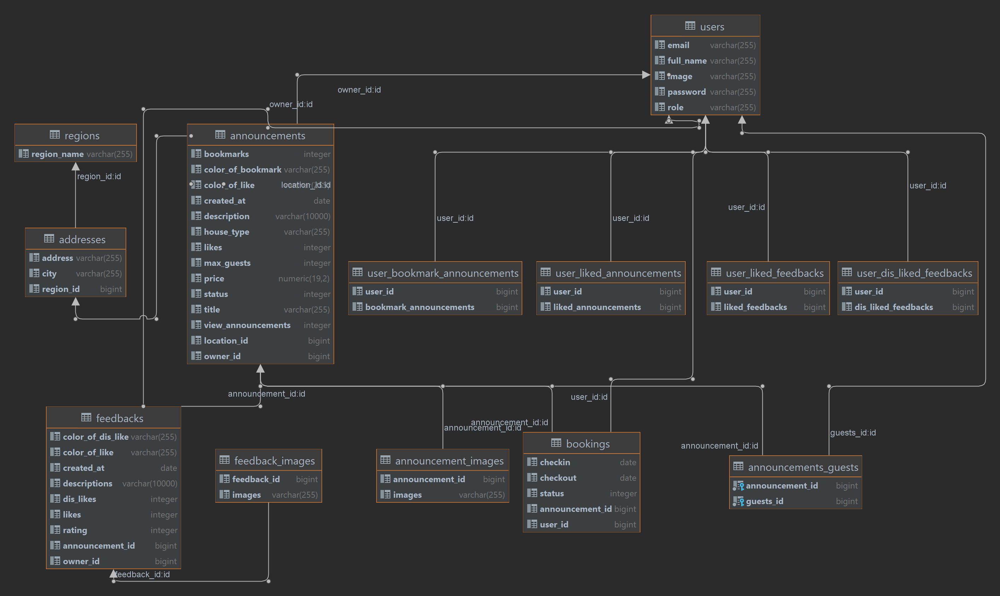

Airbnb Database Schema
=
 (https://lucid.app/lucidchart/819a267e-87de-4ffb-b506-7b39a4a2146a/edit?invitationId=inv_550a8c12-84a6-46a9-a56e-a77cf90b8f06&page=0_0#?referringapp=slack)

Backend Swagger Link
=
 (http://airbnb-env.eba-bxmudt83.eu-central-1.elasticbeanstalk.com/swagger-ui/index.html)

Figma UI Design
=
 (https://www.figma.com/file/qYJpUbocX2Nk0xrXLwQh5X/Airbnb?node-id=0%3A1)
